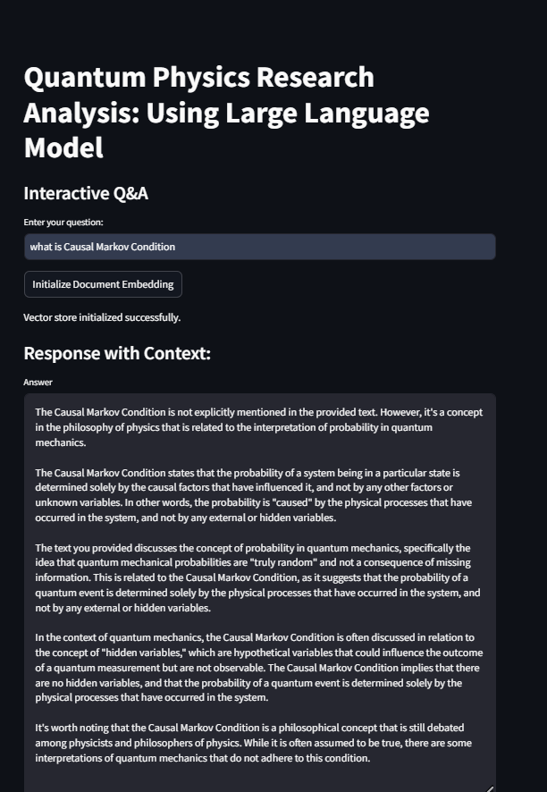

# Quantum Physics Language Model

This project leverages language model capabilities to facilitate the analysis of quantum physics research papers. Users can interact with the system by asking questions, and the model generates responses both with and without context from uploaded documents. This application utilizes **LangChain**, **Groq**, and **Google Generative AI Embeddings** to streamline research and analysis workflows.

## Features

1. **Document Embedding and Retrieval**:
   - Converts research papers into vector embeddings using **Google Generative AI Embeddings**.
   - Organizes documents into a **FAISS vector store** for efficient retrieval.

2. **Interactive Question-Answering**:
   - Answers user queries using both document-based context and general model knowledge.
   - Displays relevant document excerpts for context-based answers.

3. **Customizable Prompt Templates**:
   - Utilizes structured templates to tailor the language model's responses.

4. **Streamlit Interface**:
   - Provides an intuitive and user-friendly interface for question input and answer display.
   - Supports real-time interactions and visualizes relevant document excerpts.

---

## Installation and Setup

### Prerequisites
Ensure you have the following installed:
- **Python 3.8+**
- **pip** or **conda**
- **Streamlit**

### Dependencies
Install required Python libraries:

```bash
pip install streamlit langchain langchain-google-genai langchain-community langchain-groq faiss-cpu
```

### API Keys
The application requires API keys for **Google Generative AI** and **Groq**.
- Set your API keys in the environment variables:

```bash
export GOOGLE_API_KEY="your_google_api_key"
export groq_api_key="your_groq_api_key"
```

### Data Preparation
Save your research papers as PDFs in a folder named `data` at the root of the project directory.

---

## File Structure

```plaintext
quantum-physics-research-analysis/
├── app.py               # Main application file
├── data/                # Directory for storing research papers (PDF format)
├── images/              # Directory for storing application screenshots
├── README.md            # Documentation for the project
├── requirements.txt     # Python dependencies
```

---

## Key Components

### Technologies Used
- **LangChain**: Framework for building applications with LLMs.
- **Groq**: LLM provider for high-performance inference.
- **Google Generative AI**: Embedding model for document vectorization.
- **FAISS**: Library for efficient similarity search.
- **Streamlit**: Frontend framework for interactive UI.

### Main Functions
- **`initialize_vector_store`**:
  Loads PDF documents, splits them into chunks, and converts them into embeddings stored in a FAISS vector database.

- **`create_retrieval_chain_with_context`**:
  Establishes a document retrieval chain for generating context-aware answers.

- **`handle_user_question`**:
  Manages user queries and provides both context-based and general responses.

---

## Example Workflow

1. Upload quantum physics research papers into the `data` directory.
2. Initialize embeddings through the Streamlit interface.
3. Ask a question (e.g., *"Explain quantum entanglement"*).
4. Receive answers with and without relevant document excerpts.

---

## Screenshots

Here are some screenshots of the application:




---

## Future Enhancements
- Integration with **additional embedding models** for broader compatibility.
- Support for more file formats (e.g., Word documents, text files).
- Enhanced UI with visualization of embeddings.
- Fine-tuning LLMs on specific quantum physics datasets.

---

## License
This project is licensed under the MIT License. See the `LICENSE` file for details.

---
